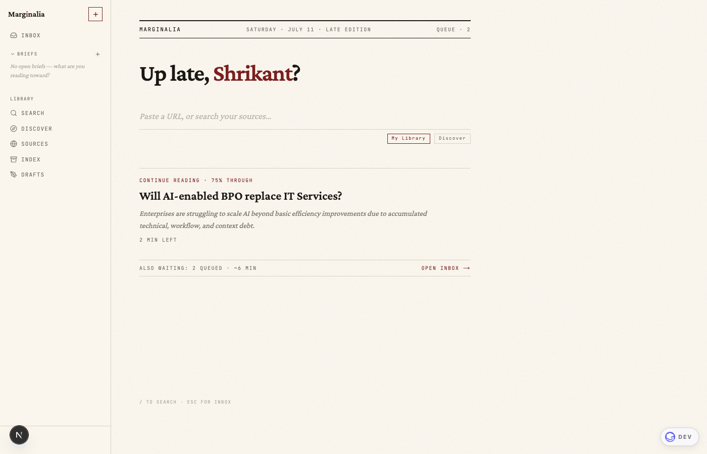

# Marginalia

**A quiet, AI-assisted reading list.** Paste a URL, get a clean TL;DR, then come back to what's worth it. Marginalia keeps the long reads you mean to return to, summarizes and tags them, lets you search your library by meaning (or the web through sources you trust), and hands you back your half-read article when you return.

Built on the free-tier "vibe stack": **Next.js 15 · Stack Auth · Supabase (Postgres + pgvector) · Google Gemini**, deployable on Vercel.



---

## What it does

- **Save & summarize** — paste any article URL; Mozilla Readability extracts the text and Gemini writes a 3–4 sentence TL;DR plus tags. Content is sanitized before it's ever rendered.
- **Find** — one search surface with a *Library / Web* toggle. Library is semantic search over what you've saved (pgvector cosine similarity); Web is **Discover**: guardrailed search of the open web restricted to sites and authors you trust, with one-click capture.
- **Briefs** — question-driven collections ("Why do data platforms fail after the pilot?"). New saves auto-route to matching briefs by embedding similarity.
- **The reader** — a clean reading view with highlights, notes, and an in-page AI chat: ask questions grounded in the article, or select a passage to discuss it. Reading progress is tracked as you scroll.
- **The front page** — signing in lands on a newspaper-style home: a masthead and greeting from your browser clock, one omnibox, and the *lede* — your most recent half-read article with how many minutes are left. When nothing's half-read, it composes a single honest sentence about your state instead. Nothing is fabricated; nothing needs dismissing.
- **Drafts** — select several articles and Gemini streams a synthesis draft from their summaries, notes, and highlights.

---

## Architecture

```
POST /api/items  (save a URL)
  → fetchAndSummarize()   fetch → Readability → sanitize → Gemini 2.5 Flash (TL;DR + tags)
  → checkAndLog()         atomic daily-limit check
  → embed()               Gemini embedding-001 (768d) — fire-and-forget
  → autoRouteToBriefs()   link to matching open briefs (cosine ≥ 0.55)
  → supabase.insert()
  → generateEditorialNote()  one-line "how this connects" note, after the response
```

Next.js App Router (Server Components for auth + data, `"use client"` for interactivity), Stack Auth for identity, a secret-key Supabase client server-side (app-level `user_id` scoping is the security boundary), Gemini for summaries/embeddings/chat, and Tavily for web search. Full architecture, routes, and libraries are documented in [CLAUDE.md](CLAUDE.md); the design system in [DESIGN.md](DESIGN.md).

---

## Run it locally

You need free accounts on three services (**Supabase**, **Stack Auth**, **Gemini**), and optionally **Tavily** for web search.

```bash
git clone https://github.com/ShrikantLambe/marginalia.git
cd marginalia
cp .env.example .env.local     # fill in the values below
npm install
```

### 1. Supabase

1. Create a project at <https://supabase.com>.
2. **SQL Editor → New query**: run the migrations in [`supabase/migrations/`](supabase/migrations/) **in numbered order** (001 → 018). They are the source of truth for the schema.
3. **Project Settings → API Keys**, copy:
   - `Project URL` → `NEXT_PUBLIC_SUPABASE_URL`
   - the **secret** key (`sb_secret_…`) → `SUPABASE_SECRET_KEY`

   > Use the **secret** key, not the publishable/anon key. The server bypasses RLS and scopes every query by `user_id` in code. A publishable key returns zero rows once RLS is enabled.

### 2. Stack Auth

1. Create a project at <https://app.stack-auth.com>.
2. **API Keys**, copy `Project ID`, `Publishable Client Key`, and `Secret Server Key` into the matching `NEXT_PUBLIC_STACK_*` / `STACK_SECRET_SERVER_KEY` vars.
3. **Domains & Handlers**: add `http://localhost:3000` (and your Vercel URL after deploying).

### 3. Gemini

Create a key at <https://aistudio.google.com/apikey> → `GEMINI_API_KEY`.

### 4. Tavily (optional — powers Web search)

Get a key at <https://tavily.com> → `TAVILY_API_KEY`. Without one, Web search uses a built-in mock provider (fine for development).

Then:

```bash
npm run dev      # http://localhost:3000 → sign up → paste a URL
```

See [.env.example](.env.example) for the full variable list.

---

## Deploy to Vercel

1. Push to GitHub and import the repo at <https://vercel.com/new> (or `npm i -g vercel && vercel`).
2. Add every variable from `.env.local` under **Project → Settings → Environment Variables**. Set `CRON_SECRET` too — the daily clustering cron authenticates with it.
3. Add your `https://<project>.vercel.app` URL under Stack Auth **Domains & Handlers**, or sign-in callbacks fail in production.
4. Redeploy.

`vercel.json` registers a daily cron that re-clusters reading themes.

---

## Development

```bash
npm run dev     # dev server
npm run lint    # ESLint (next/core-web-vitals)
npm test        # Vitest — pure lib utilities (domains, discover enforcement, bylines, home resolver)
npm run build   # production build
```

CI ([.github/workflows/ci.yml](.github/workflows/ci.yml)) runs typecheck + lint + tests on every push and PR; Vercel is the build/deploy gate.

---

## Customizing

- **Different LLM?** Swap [`lib/summarize.ts`](lib/summarize.ts) — the OpenAI/Anthropic/OpenRouter SDKs share the `generateContent(prompt) → text` shape. Keep the `---TAGS---` separator contract the parser relies on.
- **Different aesthetic?** Design tokens live in [`tailwind.config.ts`](tailwind.config.ts) and [`app/globals.css`](app/globals.css); the full system is in [DESIGN.md](DESIGN.md).
- **Different search provider?** [`lib/search-provider.ts`](lib/search-provider.ts) isolates Tavily behind a thin adapter — implement the same interface for Exa/Brave.

---

## Free-tier limits

| Service    | Free limit                               | At the limit                          |
|------------|------------------------------------------|---------------------------------------|
| Vercel     | 100 GB bandwidth / mo (hobby)            | App stops serving until next month    |
| Supabase   | 500 MB DB, 50K MAU, pauses after 7d idle | Project pauses; resume from dashboard |
| Stack Auth | 10,000 users                             | Sign-ups blocked until you upgrade    |
| Gemini API | Generous, rate-limited                   | 429s during bursts                    |

For a personal reading list you won't hit any of these.

---

## License

[MIT](LICENSE) © Shrikant Lambe
